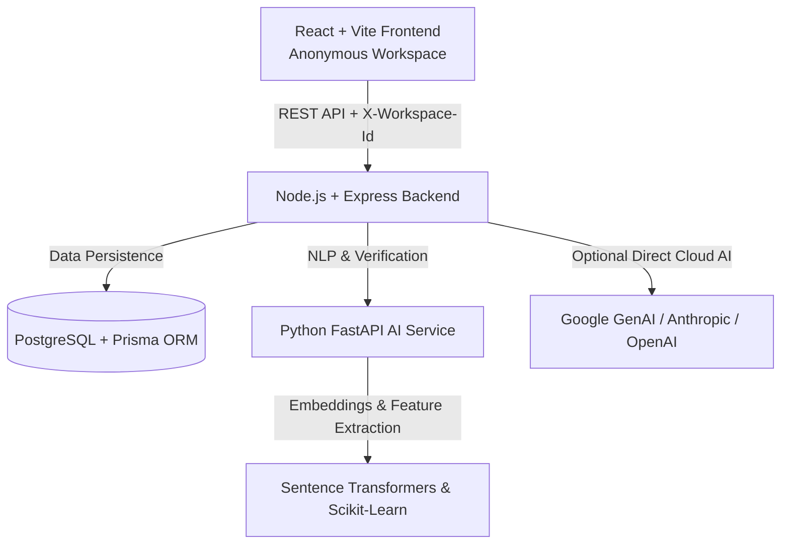

# SIDMORPH System Architecture

## Overview
SIDMORPH is an enterprise-grade full-stack platform for AI-powered writing transformation, potential textual overlap detection, AI-writing indicators, and semantic verification.

## Architectural Layers

### 1. Presentation Layer (Frontend)
- **Framework**: React 19, Vite, Tailwind CSS v4, Motion
- **Design Philosophy**: Editorial technology aesthetic inspired by scholarly publications (`#372C2E` charcoal brown background, `#563727` deep surfaces, `#D9E48A` lime accent, Cormorant Garamond serif headings, Plus Jakarta Sans body, JetBrains Mono tabular figures).
- **Workspace Model**: Anonymous workspace ID generated client-side (`sidmorph_workspace_id`), zero login/registration friction.
- **Editor**: Rich-text interface with contextual floating action bar (`Morph`, `Rephrase`, `Academic`, `Concise`, `Simplify`, `Explain`).

### 2. Application & API Gateway (Backend)
- **Framework**: Node.js, Express.js
- **Isolation Middleware**: Validates `X-Workspace-Id` header on every document request to ensure strict tenant isolation without credential overhead.
- **REST Endpoints**: Complete CRUD for Documents, Versions, Analyses, Rewrites, Citations, and Metrics.
- **Resilience Engine**: Dual-mode execution—interfaces with cloud LLMs when configured, while gracefully falling back to deterministic algorithmic engines when offline.

### 3. Data & Persistence Layer
- **Database**: PostgreSQL 16
- **ORM**: Prisma ORM with strictly typed relational schema (Workspaces, Documents, DocumentVersions, Analyses, SimilarityMatches, AIAnalyses, AIIndicators, Rewrites, Citations, WritingMetrics).

### 4. AI & NLP Pipeline Service
- **Framework**: Python 3.10+, FastAPI, Uvicorn
- **NLP Libraries**: NLTK, Scikit-learn, Sentence-Transformers
- **Core Pipelines**:
  1. Potential Textual Overlap / Similarity Analysis
  2. Multi-feature AI-Writing Classifier (Sentence variance CV, RTTR, Transition Entropy)
  3. Factual & Semantic Meaning Verification Gate
  4. Citation Guardian (APA, MLA, IEEE, Author-Year)
