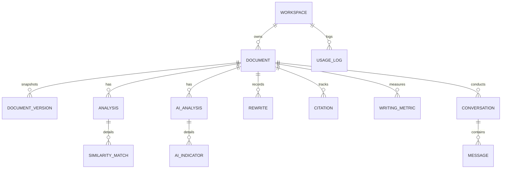

# Database Schema & Entity Relationships

The SidMorph relational schema is managed via Prisma ORM on PostgreSQL.

## Entity Relational Model

## Schema Entities Summary
1. **Workspace**: Anonymous container identifying documents from a browser session (`id`, `createdAt`, `updatedAt`).
2. **Document**: Manuscript root entity (`title`, `content`, `wordCount`, `archivedAt`).
3. **DocumentVersion**: Immutable historical snapshot (`versionNumber`, `content`, `wordCount`).
4. **Analysis**: Potential textual overlap & quality report (`similarityScore`, `qualityScore`, `meaningScore`).
5. **SimilarityMatch**: N-gram / boilerplate match segments (`text`, `similarity`, `category`, `reason`).
6. **AIAnalysis**: Statistical classifier results (`aiLikelihood`, `confidence`, `model`).
7. **AIIndicator**: Segment-level indicators (`score`, `indicatorType`, `explanation`).
8. **Rewrite**: Morph audit trail (`originalText`, `rewrittenText`, `mode`, `intensity`, `meaningScore`).
9. **Citation**: Scholarly reference tracking (`citationText`, `citationStyle`, `position`).
10. **WritingMetric**: Structural analytics (`readabilityScore`, `passiveVoicePercentage`, `averageSentenceLength`).
