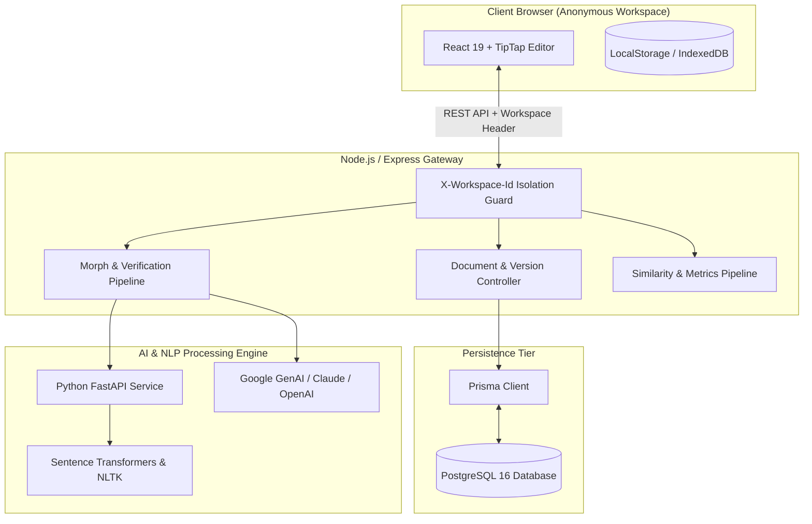

# SIDMORPH

> **Rewrite. Refine. Preserve Meaning.**

An AI-powered writing transformation, originality, and AI-writing analysis platform engineered for scholars, researchers, and professional authors.

```
DETECT → MORPH → VERIFY
```

---

## 🏛️ Project Overview

**SidMorph** is an editorial technology platform designed to transform academic, scientific, and professional manuscripts without sacrificing meaning, citations, or authentic authorial voice.

Unlike superficial thesaurus spinners or bypass tools, SidMorph operates with strict attribution ethics:
- **Potential Textual Overlap Detection**: Identifies formulaic academic boilerplate, 5-gram token overlap, and structural repetition with transparent rationale.
- **AI-Writing Indicators**: Evaluates statistical burstiness, sentence length variance, Type-Token Ratio, and transition distribution with a transparent probabilistic disclaimer.
- **Semantic Meaning Verification Gate**: Validates factual consistency, numerical integrity, dates, entities, and citation retention before displaying transformations as approved.
- **Citation Guardian**: Scans and preserves APA, MLA, IEEE, and numbered reference styles, warning users of uncited empirical claims.
- **Anonymous Workspace**: Zero login, registration, or password storage. Workspaces operate through local-first browser persistence.

---

## 📐 Architecture Diagram



---

## 🚀 Key Features

| Capability | Description |
| :--- | :--- |
| **AI Morph Engine** | Deep syntactic reconstruction supporting Academic, Research, Technical, Professional, Natural, Simple, and Concise modes. |
| **Quality Verification Gate** | Validates factual claims, numerical values, and technical nomenclature; triggers `⚠ REVIEW REQUIRED` if meaning drift is detected. |
| **Citation Guardian** | Preserves APA, MLA, IEEE, and numbered references (`[1]`, `(Author, 2024)`), detecting uncited statistical assertions. |
| **Keep My Voice** | Analyzes personal writing samples to extract cadence, sentence length variance, and vocabulary preferences. |
| **Before / After Diff** | Side-by-side comparison with word-level addition/deletion highlighting and individual change accept/reject controls. |
| **Document Processing** | Drag-and-drop parsing for PDF, DOCX, and TXT manuscripts with size and format validation. |
| **Version History** | Automated snapshots before major morphs with instant restoration and rollback capabilities. |
| **Document Export** | High-fidelity export to DOCX, PDF, and plain text. |

---

## 🔬 AI Detection & Similarity Methodology

### Potential Textual Overlap
Potential overlap is computed via lexical n-gram decomposition and comparison against high-frequency literature boilerplate. 
> *Important:* A similarity score is **never** presented as definitive proof of plagiarism. Similarity measurements simply identify textual resemblance to published or formulaic sequences.

### AI-Writing Classification
SidMorph evaluates statistical and distributional features:
1. **Sentence Uniformity (Burstiness)**: Calculates the Coefficient of Variation ($CV = \sigma / \mu$). Machine-generated prose typically exhibits low variance ($CV < 0.35$), clustering around 18–24 words.
2. **Root Type-Token Ratio (RTTR)**: Evaluates vocabulary entropy across paragraphs ($V / \sqrt{N}$).
3. **Discourse Predictability**: Flags clustering of formulaic markers ("delve", "pivotal role", "testament").
> *Notice:* AI-writing analysis is an estimate and may produce false positives and false negatives. SidMorph does not market detection as proof of authorship.

---

## 🛠️ Technology Stack

- **Frontend**: React 19, Vite, Tailwind CSS v4, Motion, Lucide React, Canvas Confetti, Diff
- **Backend**: Node.js, Express.js, TypeScript, TSX
- **Database & ORM**: PostgreSQL 16, Prisma ORM
- **AI Service**: Python 3.10+, FastAPI, Uvicorn, Sentence-Transformers, PyTorch
- **AI SDK**: `@google/genai` (Google Gemini 2.5 Flash / Pro)
- **Containerization**: Docker, Docker Compose

---

## 📦 Local Installation & Setup

### Prerequisites
- Node.js 20+
- Python 3.10+
- Docker & Docker Compose (optional for containerized deployment)

### 1. Clone & Install
```bash
git clone https://github.com/your-username/sidmorph.git
cd sidmorph
npm install
```

### 2. Configure Environment
```bash
cp .env.example .env
# Add GEMINI_API_KEY or DATABASE_URL if connecting to external database
```

### 3. Start Development Server
```bash
npm run dev
```
The full-stack application will be live at `http://localhost:3000`.

---

## 🐳 Docker Multi-Service Deployment

Run the complete multi-tier stack (Frontend, Backend, FastAPI AI Service, PostgreSQL):

```bash
docker compose up -d --build
```

Endpoints:
- Frontend: `http://localhost:3000`
- Backend API: `http://localhost:5000`
- Python AI Service: `http://localhost:8000`
- PostgreSQL: `localhost:5432`

---

## 🔒 Privacy & Anonymous Workspace

- **Zero Authentication Friction**: No passwords, emails, or personal profiles collected.
- **Session Scoping**: Documents belong strictly to your browser session workspace identifier (`sidmorph_workspace_id`).
- **Secret Isolation**: All API keys remain isolated server-side.
- **Unilateral Erasure**: Deleting a document or clearing local storage permanently purges your session records.

---

## 📄 License

Distributed under the [MIT License](LICENSE).
